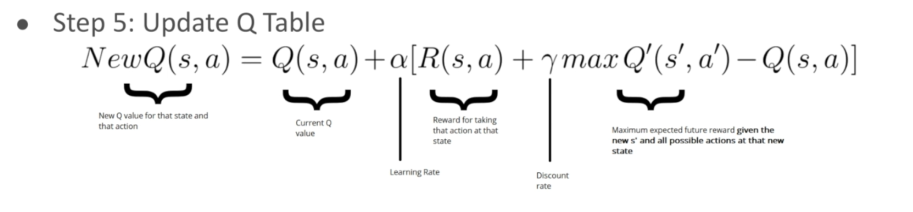
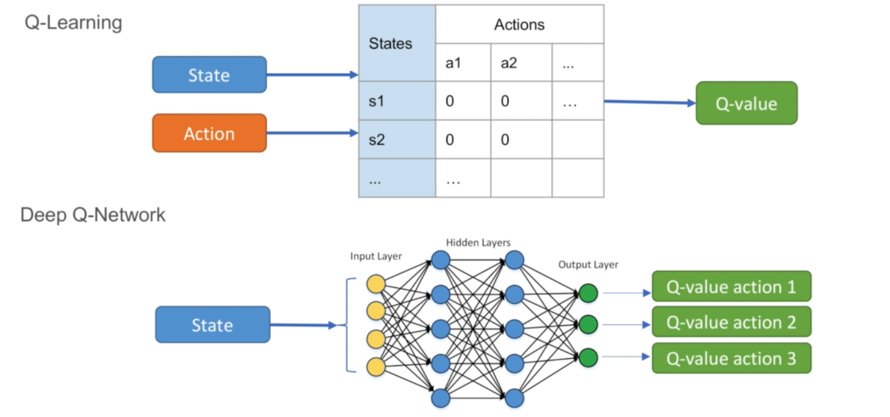

# RL Udemy

## **RL formulation** 
implemented by **Markov decision** model (MDP)

1. environment 

2. agent

3. states

4. action

5. reward function

6. state transition distribution

   

**Optimal policy** 

agent : policy , value function , model policy : maps states to action model = what the environment doing the future : 

   - predict next state

   - predict next(immediate) reward 

can be model free algorithm 

value function : estimate of future reward e.g. . q value (quality) of action - value map state-action pairs to expected rewards 

**q-table**

   history : sequence of <state, reward,action>

S0, R0 , A0, S1, R1, S1 , ... 

   RL GOAL : maximize earned rewards , ie finds a policy to maximize the reward **policy** p maps states to actions that promises s highest rewards 
   Optimal q value

 

   gamma is between 0 and 1 

   **intuition behind gamma** is a discount actor, the gamma will control the greed of policy, if q is close to 0, it will be more greedy and if closer to 1, agent will focus on long term optimization 
   **Bellman equation :**

value function = the current reward + Q value of the next state s' and a'

##  **Q Learning**

bellman equation 

   example frozen lake

step 1, make the q table 

step 2: choose and action : balance between exploration and exploitation

step 3 -4 = perform and measure reward

**SARSA = state action reward state action** 

off policy algorithm uses greedy not table 

   

   **Deep q network** when very large, we use deep 

   

 ## Exploration vs exploitation :

 explore = gather more info

exploit = make best decision based on current state

we need to have a balance 

at start, we start with large epsilon and when we go in tome and gather experience, we decrease the epsilon to use your knowledge 

   **Define RL problems - examples** problem to rl 

1. identify env and states
2. identify learning agents
3. a good reward func 
4. bellman equation to update q value